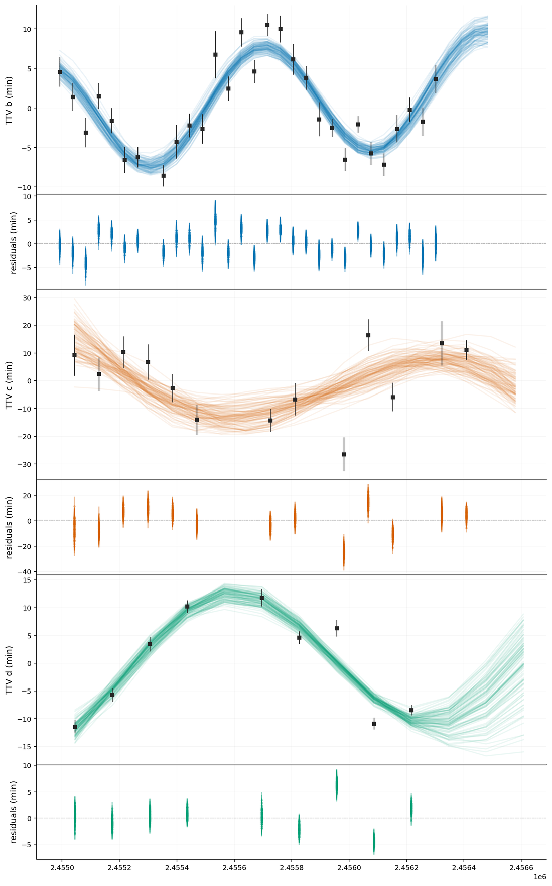
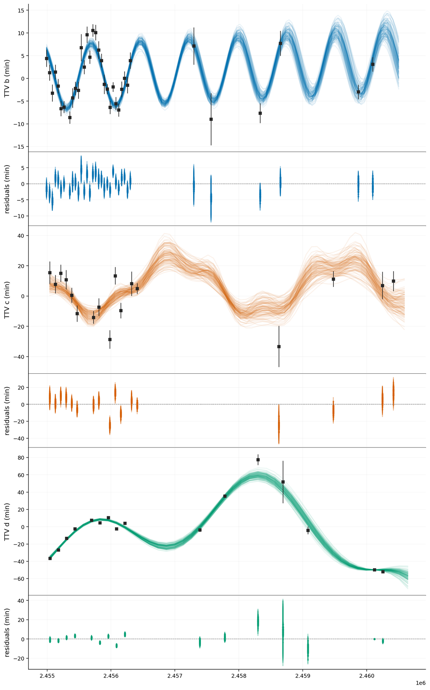

# harmonic

Multi-harmonic transit-timing-variation (TTV) model fitting and transit prediction for exoplanet systems.

Transit timing variations arise when planets in a multi-planet system gravitationally perturb one another, shifting their transit times away from strict periodicity. **harmonic** models these variations as a superposition of sinusoids at the systems' TTV super-periods, fits them to observed transit times with `scipy` least-squares and `emcee` MCMC, and turns the posterior into planet-mass constraints and future-transit predictions — including for **non-transiting** companions seen only through their perturbations.

```bash
pip install -e .
harmonic -i examples/kep51.csv -c examples/kep51.ini -o results/
```

See the [Guide](usage.md) to get started, [The TTV model](model.md) for the method, the [CLI reference](cli.md) for every flag, and the [API reference](api.md) for the Python interface.

## Example: Kepler-51 and a fourth planet

Kepler-51 has three transiting planets (b, c, d) with strong, mutually-interacting TTVs. Fitting the Kepler-baseline transit times (through 2016) with three planets reproduces the data well:

```bash
harmonic -i examples/kep51.csv -c examples/kep51.ini -o kep51/
```



Extending the baseline to 2024 adds post-Kepler transits — including the JWST-era timing of Kepler-51d that Masuda et al. (2024) found strongly discrepant with any three-planet model. Re-fitting the extended data with three planets is poor (reduced χ² ≈ 20). Adding a **fourth, non-transiting outer planet** with `-n` restores the fit (reduced χ² ≈ 4) and constrains its mass to of order a few Earth masses — consistent with the Kepler-51e reported by Masuda et al. (2024):

```bash
harmonic -i examples/kep51-extended.csv -c examples/kep51-extended.ini -o kep51-extended/ -n
```



The non-transiting planet is constrained purely by the gravitational perturbation it imprints on the transit times of the inner three.

## References

The method is described and applied in detail (Methods and Supplementary Information) in [Livingston et al. (2026)](https://www.nature.com/articles/s41586-025-09840-z).

Further reading:

- Lithwick et al. (2012) — TTV mass constraints
- Nesvorný & Vokrouhlický (2016) — analytic Hamiltonian TTV model for planets in resonance
- Masuda et al. (2024) — Kepler-51's fourth planet from a decade-long TTV baseline
